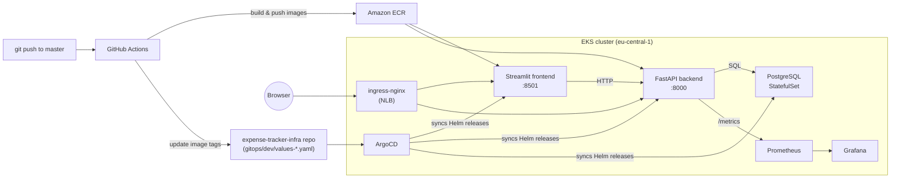

# Expense Tracker

## The idea

I wanted a project that goes through the *whole* DevOps loop, not just "containerize an
app and call it done": write the app, package it, define the infrastructure as code,
deploy it through GitOps, wire up CI/CD so a `git push` ships to a real cluster, and
have monitoring in place so I'd actually know if something broke — all on AWS, on a
student budget.

This is an expense tracker app — a FastAPI backend backed by PostgreSQL, with a
Streamlit UI for adding, listing, and summarizing expenses. The point isn't really
the app itself; it's everything around it: Terraform-provisioned EKS, Helm charts,
ArgoCD GitOps deploys, GitHub Actions CI/CD, and Prometheus/Grafana monitoring,
all built so the whole stack can be spun up for a session and torn down again
without leaving anything running (and billing) overnight.

## Architecture



| Service  | Tech               | Port |
| -------- | ------------------ | ---- |
| frontend | Python + Streamlit | 8501 |
| backend  | Python + FastAPI   | 8000 |
| db       | PostgreSQL 16      | 5432 |

## What I used

- **App**: Python, FastAPI, Streamlit, PostgreSQL, pytest, ruff
- **Containers**: Docker, multi-stage builds, Docker Compose for local dev
- **Infrastructure as Code**: Terraform (`terraform-aws-modules/vpc`, `terraform-aws-modules/eks`, IAM/OIDC for GitHub Actions)
- **Orchestration**: Amazon EKS, AWS EBS CSI driver
- **Packaging & GitOps**: Helm charts (per service + Bitnami `postgresql` dependency), ArgoCD "app of apps"
- **CI/CD**: GitHub Actions (lint/test/build, deploy-to-staging on merge, deploy-to-production on tag), GitHub Flow
- **Monitoring**: kube-prometheus-stack (Prometheus + Grafana + Alertmanager), `prometheus-fastapi-instrumentator`, Slack alerts
- **Registry**: Amazon ECR

## Project layout

This project spans two repos:

```
expense-tracker/                 # this repo - the application
├── backend/                     # FastAPI service (+ tests)
├── frontend/                    # Streamlit UI
├── charts/
│   ├── backend/                 # Deployment, Service, Ingress, ServiceMonitor, seed Job
│   ├── frontend/                # Deployment, Service, Ingress
│   └── db/                      # thin wrapper around the Bitnami postgresql chart
└── .github/workflows/
    ├── ci.yml                   # lint + test + build (PRs)
    ├── deploy-staging.yml       # build, push to ECR, update GitOps repo (push to master)
    └── deploy-production.yml    # same, tagged release (push tag v*.*.*)

expense-tracker-infra/           # sibling repo - infrastructure + GitOps
├── bootstrap/                   # one-time: S3 state bucket + DynamoDB lock table
├── modules/platform/            # VPC, EKS, ECR, GitHub OIDC IAM role, EBS CSI
├── envs/dev/                    # the environment - calls modules/platform,
│                                 # installs ingress-nginx / ArgoCD / kube-prometheus-stack
└── gitops/dev/                  # ArgoCD Application manifests + per-env Helm values
```

## Prerequisites

- AWS account + credentials with the permissions in `expense-tracker-infra/expense-tracker-terraform-policy.json`
- `terraform` >= 1.6, `aws` CLI, `kubectl`, `helm`
- Docker (for local dev)
- A fork/clone of both `expense-tracker` and `expense-tracker-infra`

## Running it

A managed EKS control plane bills by the hour even when idle, so this project is
meant to be brought **up** for a session and torn **down** afterward.

### Every morning

```bash
cd expense-tracker-infra/envs/dev
terraform apply                       # ~10-15 min: VPC, EKS, ECR, ArgoCD, monitoring

aws eks update-kubeconfig --name expense-tracker-dev --region eu-central-1
kubectl apply -f ../../gitops/dev/root-app.yaml   # bootstrap ArgoCD "app of apps"
```

ArgoCD then syncs the backend, frontend, and db Applications from this repo's
`charts/` using values from `expense-tracker-infra/gitops/dev/values-*.yaml`.
A `git push` to `master` (after this point) rebuilds images, pushes to ECR, and
updates those values files automatically — ArgoCD picks up the change.

### Every evening

```bash
cd expense-tracker-infra/envs/dev
terraform destroy
```

This tears down the EKS cluster, NAT gateway, load balancer, and everything else —
running it before bed instead of leaving the cluster up overnight saves roughly
$3-4/day in EKS control plane, NAT gateway, and NLB charges alone.

### Verify everything is destroyed

```bash
aws eks list-clusters --region eu-central-1                 # []
aws ec2 describe-instances --region eu-central-1 \
  --filters "Name=instance-state-name,Values=running,pending" \
  --query 'Reservations[*].Instances[*].InstanceId'          # []
aws ec2 describe-addresses --region eu-central-1             # []
aws ecr describe-repositories --region eu-central-1 \
  --query 'repositories[*].repositoryName'                   # []
```

If any of these come back non-empty, something didn't get cleaned up and is
still billing.

## Two environments

| | Local | AWS (dev cluster) |
| --- | --- | --- |
| How | `docker compose up --build` | `terraform apply` in `expense-tracker-infra/envs/dev` |
| Frontend | http://localhost:8501 | via ingress-nginx NLB, host `expense-tracker.local` |
| Backend | http://localhost:8000/docs | via NLB, host `api.expense-tracker.local` |
| Database | local Postgres container | Bitnami `postgresql` StatefulSet + EBS PVC |
| Deploys | manual rebuild | GitHub Actions → ECR → ArgoCD GitOps |

A `git push` to `master` deploys to the AWS dev cluster (staging-style); pushing a
`v*.*.*` tag re-builds and promotes that exact image as a "production" release —
this project runs a single budget-friendly environment, with the production
workflow as the pattern to extend once a second environment exists.

## The demo

With the cluster up:

1. **ArgoCD** — `terraform output -raw argocd_ingress_hostname_command | bash` for the
   URL, `terraform output -raw argocd_admin_password_command | bash` for the password.
   All four Applications (`expense-tracker-dev`, `-backend-dev`, `-frontend-dev`,
   `-db-dev`) should show **Synced / Healthy**.
2. **The app** — open `http://expense-tracker.local` (via the NLB hostname + `Host`
   header, or add it to `/etc/hosts`) for the Streamlit UI, and
   `http://api.expense-tracker.local/docs` for the FastAPI Swagger UI.
3. **Grafana** — `kubectl port-forward -n monitoring svc/kube-prometheus-stack-grafana 3000:80`,
   open `http://localhost:3000` and check the cluster/node/pod dashboards plus the
   backend's custom `/metrics`.
4. **CI/CD** — push a small change to `master` and watch GitHub Actions build, push to
   ECR, and commit the new image tag to `expense-tracker-infra`; ArgoCD self-heals the
   running Deployment within a couple of minutes.
5. **Alerts** — crash-loop a pod (e.g. scale the backend to an image tag that doesn't
   exist) and watch Alertmanager fire `KubePodCrashLooping` to Slack.

## Cost (just for my own project)

Rough hourly cost while the cluster is up (`eu-central-1`, on-demand pricing):

| Resource | Approx. cost |
| --- | --- |
| EKS control plane | $0.10 / hour |
| NAT gateway | $0.045 / hour + data |
| 1-2x `t3.small` spot worker node(s) | ~$0.01-0.02 / hour each |
| Network Load Balancer (ingress) | ~$0.025 / hour + usage |
| ECR storage | negligible (few hundred MB) |
| S3 + DynamoDB (Terraform state) | negligible (always on) |

A few hours of `apply` → demo → `destroy` costs **well under $1**. Don't leave the
cluster running overnight unless you mean to.

---

Built by David — DevOps Final Project, 2026
